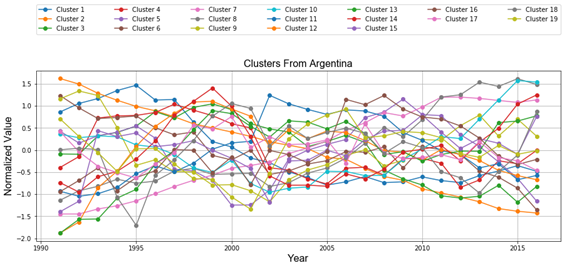
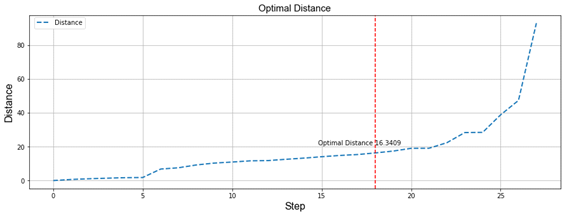
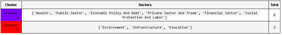
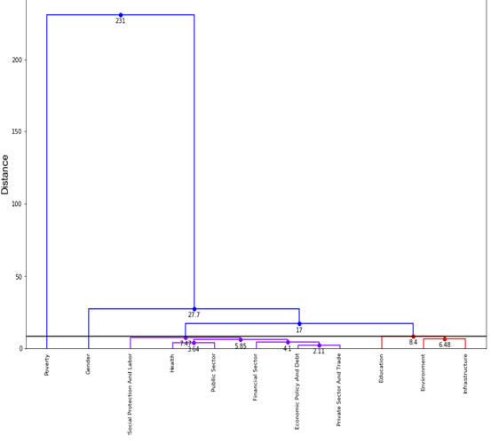
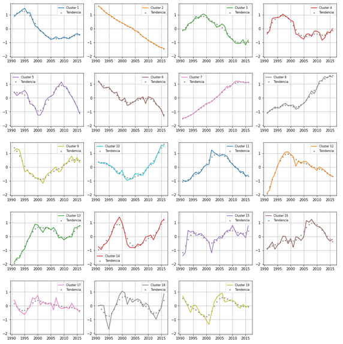

# Análisis de los Indicadores del Desarrollo de los Países de América del Sur.

Se realiza un estudio de sectores (agricultura, economía, medio ambiente, educación, infraestructura y electricidad) de los países de América del sur para determinar los indicadores que tienen mayor influencia en un sector, grado de dependencia entre indicadores, el sector con mayor influencia en el PBI de un país, dependencia entre sectores y países con comportamientos similares.

#### Resultados
Se muestra algunos resultados del estudio realizado.

##### Bibliografia
[1] 	«Banco Mundial - Country,» 02 08 2019. [En línea]. Available: https://datahelpdesk.worldbank.org/knowledgebase/articles/898590-country-api-queries.

[2] 	«Banco Mundial-How,» [En línea]. Available: http://datahelpdesk.worldbank.org/knowledgebase/articles/201175-how-does-the-world-bank-code-its-indicators. [Último acceso: 22 04 2016].

[3] 	C. R. Octavio, «Estrategias para el tratamiento de datos faltantes "missing data" en estudio con datos longitudinales,» Catalunya, 2017.

[4] 	J. P. A. J. A. M. F. Juan Gomez Garcia, «Métodos de inferencia estadística con datos faltantes. Estudio de simulacion sobre los efectos en las estimaciones,» 2006.

[5] 	G. A. Arathi M., «Effect of Mahalanobis Distance on Time Series Classification Using Shapelets,» Emerging ICT for Bridging the Future - Proceedings of the 49th Annual Convention of the Computer Society of India CSI Volume 2, pp. 525-535, 2015. 

[6] 	M. L. Y. W. a. H. G. J. Mei, «Learning a Mahalanobis Distance-Based Dynamic Time Warping Measure for Multivariate Time Series Classification,» Transactions on Cybernetics, vol. 46, nº 6, pp. 1363-1374, 2016. 

[7] 	RDocumentation, «RDocumentation,» 22 10 2019. [En línea]. Available: https://www.rdocumentation.org/packages/mice/versions/3.5.0. [Último acceso: 22 10 2019].

[8] 	Denny y D. M. Squire, «Visualization of cluster changes by comparing Self-Organizing Maps,» PAKDD, pp. 410-419, 2005. 
[9] 	L. d. l. F. Crespo, «Portal fuenterebollo,» [En línea]. Available: http://www.fuenterrebollo.com/Master-Econometria/Analisis_Cluster.pdf.

[10] 	«WorldBank - eg.elc.accs.zs,» 19 08 2019. [En línea]. Available: https://data.worldbank.org/indicator/eg.elc.accs.zs.

